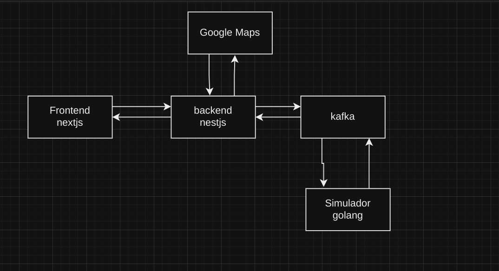

# vehicle tracking system

# Sistema de Rastreamento de veiculo em tempo real

### funcionalidades

- inicializar novas corridas
- verificar a posição do veiculo
- acompanhar amovimentação no mapa
- acompanhar o momento em que os veiculso chegam ao destino
- calcular o valor do frete

OBS: Como não possuimos carros com gps nas ruas kk, iremos criar um microserviço pra simular essa funcionalidade

### Casos de uso

- 1 criação de novas rotas: quando uma nova rota é criada o backend mandara um evento pra o kafka e as inforsmaçoes da rota, e o microserviço que simular os veiculos" vai armazenar as informaçoes da rota e todos os pontos da rota a ser feita.

- 2 apos receber a nova rota gera o frete: Os dados o microsserviço vai fazer o frete e apos ser feito, o microserviço mandara um evento pra o kafka e com o isso o nestjs vai consumir e armazenar esses dados

- 3 Entrega: uma vez que tem a rota criada e o valor do frete, inicia o processo de entrega prea essa rota x, no frontend é que seleciona a rota cadastrada e envia por nest e o nest envia um evento pro apacha kafka "iniciou o processo de entrega baseado na rota x" e com isso o nosso simulador recebe e pega o valor dessa rota e comeca dispara evento por apache kafka mandando as posiçoes de onde ta os veiculos simula um gps"

### Backend features (API de gerencimento de trajetos me Nestjs)

- Nestjs pra criar API responsavel por receber as coordenadas do veiculo e gerenciar os dados da corrida utilizando Google Maps API e disponibilzar as informaçoes pro frontend de forma eficiente e relaizar comunicação com o kafka pra comunicação assincrona real time.

- nestjs
- Google MAps API
- Prisma ORM e mongodb
- Rest
- Criar serviço para armazenar posicionamento dos motoristas em um trajeto

rotas REST

- /places?text=xxxx - Obter o place_id de um lugar no Google maps
- /directions?originId=xxxx&destinationId - Traçar trajeto entre dois lugares
- /routes Pegar rotas cadastradas ou cadastrar novas rotas

### Frontend

- Usaremos Nextjs, react js e tailwind em que usaremos ssr (server-side rendering) pra obter mais performance na amostra dos dados do backend uma vez que a perfomance sera o foco da aplicação

### Comunicaçao

- Usaremos websocket pra comunição em tempo real e continua entre client-server pra ver o posicionamento dos veiculso em tempo real
- Pro frontend ser atualizado em tempo real precisa-se te ruma conexaõ aberta (em tempo real) entre o front e o backend e pra isso usaremos websocket que é um protocolo bem conhecido pra ocmunicação em real time que roda em cima do http e abre uma comunição tcp entre o front e o back.
- usaremos o apache kafka pra comunição assincrona em tempo real, distribuição das coordenadas e gerando fluxo constante de informaçoes sem perda de performance
- o microsserviço responsavel por simular as coordenadas do veiculo enviado os dados por apache kafka e fazer o calculo do frete sera feita em linguagem GO por ser performatica

### Ambiente

-Todos os microserviços sera feito em docker pra facil gerenciamento, manutenção, portabilidade e praticidade.
